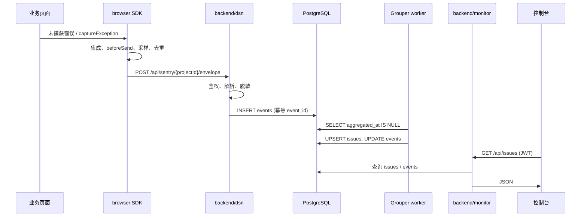

# 数据流详解

从用户浏览器到控制台 Issue 列表的完整路径，含幂等与失败行为。

## 总览



## 阶段 1：SDK 采集

触发方式包括：

| 来源 | mechanism（示例） |
|------|-------------------|
| `GlobalHandlers` | `onerror` / `onunhandledrejection` |
| `captureException()` | 手动 |
| `BrowserApiErrors` | 资源加载失败 |

`BrowserClient` 会：

1. 从 `Error.stack` 解析栈帧
2. 可选展开 `Error.cause` 链
3. 合并 Scope 中的 user、tags、breadcrumbs
4. 经 `beforeSend`、采样、`ignoreErrors`、Client 内 dedupe

通过则组装 `ErrorEvent` 并写入发送队列。

## 阶段 2：Transport 上报

默认链路：

```text
BrowserClient → BufferTransport → FetchTransport → ingest
```

| 组件 | 行为 |
|------|------|
| `FetchTransport` | `POST` Envelope，`keepalive: true` |
| `BufferTransport` | 失败重试；`429` 时读 `Retry-After` 退避 |

## 阶段 3：ingest（dsn）

`POST /api/sentry/:projectId/envelope`：

1. **项目校验**：`EnvelopeService.ingest` 校验 URL 中的 `projectId` 必须存在于 `projects` 表，否则 `401`
2. **大小限制**：超过 `MAX_ENVELOPE_BYTES` → `413`
3. **解析**：`parseEnvelope` 行式格式
4. **脱敏**：`scrubObject` 过滤 password、token 等键
5. **写入**：`events` 表，`payload` 为 JSONB

### 幂等（event_id）

唯一约束：`(project_id, event_id)`。

| 情况 | HTTP | 行为 |
|------|------|------|
| 首次上报 | `201` | 插入，`stored: 1` |
| 重复 event_id | `201` | 不插入，`stored: 0` |

客户端重试不会重复计数。

## 阶段 4：Grouper 聚合

`monitor` 进程内的 `GrouperService` 定时（默认 3s）：

1. 查询 `aggregated_at IS NULL` 的 events（批量 50）
2. 对每条计算 `fingerprint`、`title`、`culprit`
3. `issues` 表 upsert（`project_id + fingerprint` 唯一）
4. 更新 event：`issue_id`、`aggregated_at`

**dsn 不写 issues 表**——聚合与查询职责分离。

## 阶段 5：控制台查询

1. 用户 `POST /api/auth/login` 获得 JWT（或空库走 `/api/setup` 首次引导）
2. `GET /api/issues?project_id=...&search=...` 分页列表；`GET /api/projects/:id/trends` 趋势
3. `GET /api/issues/:id` 详情；`symbolicator` 按 `release` 匹配 artifact 符号化堆栈
4. `GET /api/issues/:id/events` 事件历史；`GET /api/events/:id` 单条详情
5. `PATCH /api/issues/:id` 修改 `status`；`POST /api/issues/:id/comments` 评论

Release / Source Map：`POST /api/projects/:id/releases` + artifact 上传 → 影响阶段 5 堆栈展示。

告警：Grouper 创建新 Issue 时 `alerter.onNewIssue`；维护任务每小时扫描 `error_rate` 规则。

前端开发时 Vite 将 `/api` 代理到 `localhost:3002`。

## 去重与采样（多层）

```text
SDK dedupe（2s 内相同 type|message）
    → sampleRate 随机丢弃
    → ignoreErrors / denyUrls / beforeSend
    → ingest event_id 幂等
    → Issue fingerprint 合并
```

理解层次有助于排查「为什么没看到第二条报错」。

## 失败场景

| 阶段 | 失败 | 用户可见影响 |
|------|------|----------------|
| SDK | 无网络 | 事件可能丢失（MVP 无 offline 队列） |
| ingest | 401 | 未知 projectId，需检查 DSN |
| ingest | 413 | Envelope 过大 |
| ingest | 429 | 超过项目每分钟限流；SDK 读 `Retry-After` |
| Grouper | DB 断开 | Issue 不更新，events 堆积未聚合 |
| 控制台 | JWT 过期 | 需重新登录 |

## 下一步

- 动手验证：[getting-started.md](../getting-started.md)
- SDK 配置细节：[sdk-guide.md](./sdk-guide.md)
